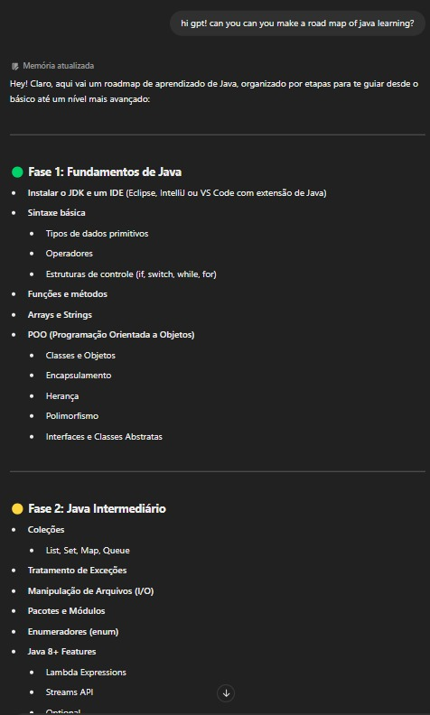
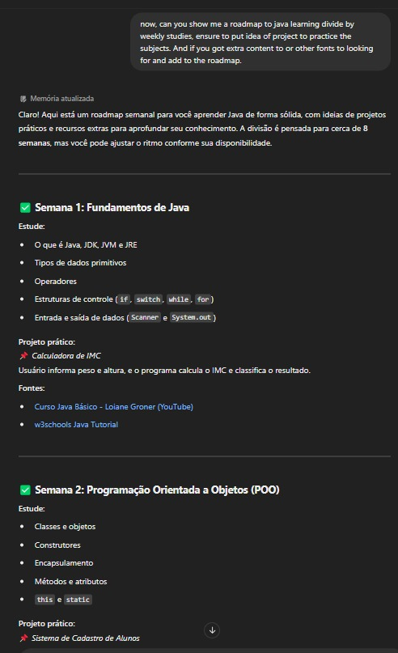

# Explorando-os-Recursos-de-IA-Generativa
## Intro
I used ChatGPT for this test. Here, I showed a bit of the difference in what you get depending on the level of complexity of your prompt:

###### Primeiro exemplo - Pergunta de forma simple:

###### Segundo exemplo - Pergunta de forma mais elaborada:

## Conclusions
Generative AI is a very powerful tool. Depending on how you write and how you use it, the output will vary.